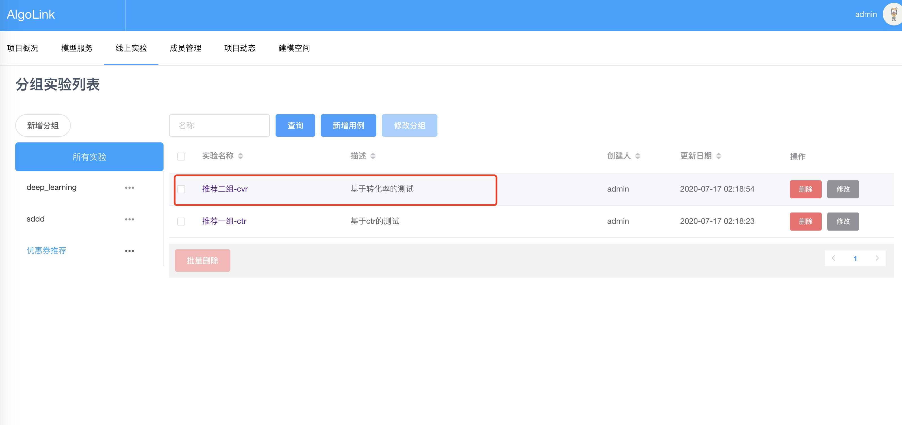
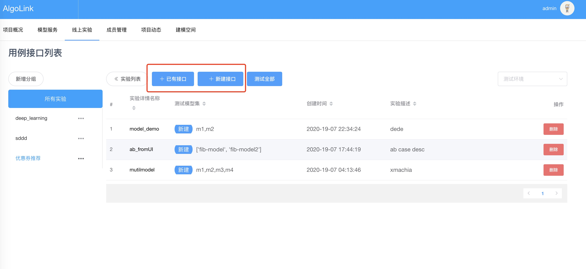
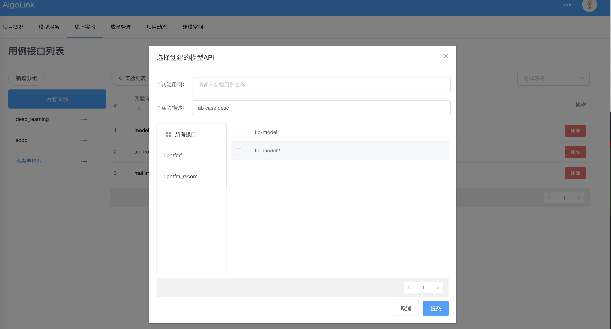
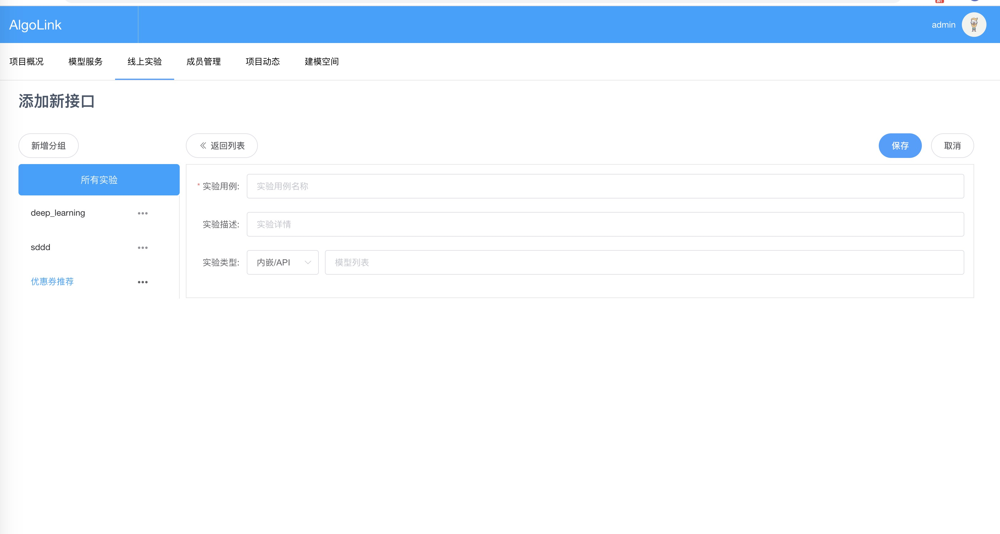
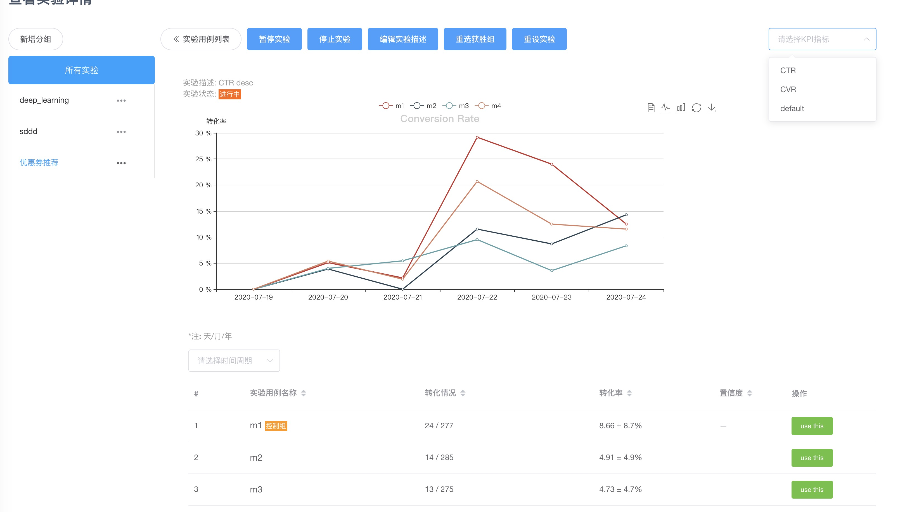

# 在线实验管理

## 概况
AlgoLink内嵌了一个跨多种编程语言进行A/B测试的服务引擎。该引擎是一个实时的、企业级的、100% API驱动的项目。特点是速度快，易于使用，它的功能非常多，客户端库几乎可以用任何语言编写。

AlgoLink-ab模块有两个主要部分。第一部分，A/B-server，负责响应网络请求；第二部分，A/B-web，是一个用于跟踪和执行A/B测试的网络仪表盘。

了解更多关于algolink-ab如何通过使用我们简单、灵活、可扩展的实验平台，让您的团队从直觉转向可操作的、以数据为导向的用户洞察力。


algolink-ab的特性及能提供什么：

- **经过验证** - algolink-ab在电商优惠券及游戏推荐系统中参与使用
- **高性能** - 服务端对用户分流的响应时间在20毫秒内
- **100% API驱动** - algolink-ab REST API几乎兼容任何语言和环境
- **实时用户分流** - 实时将用户分配到实验中，可以同一实验同时测试不同KPI指标，提高流量的复用
- **可云端后本地部署** - 该引擎设计在云端或在您自己的数据中心中使用
- **与模型部署无缝连接** - 基于前面创建的模型服务创建实验和分流（API数量>=2）
- **分析** - 开箱即用的核心实验分析和指标可视化，以及具备将数据发送到您现有的分析基础设施的能力
- **可插拔** - 定义良好的接口，用于嵌入您自己的访问控制，将数据发送至数据管道，并提供在接口自定义流量分配比例
- **实验管理用户界面** - 通过现代化界面设置和管理实验，也可以通过REST API进行管理
- **灵活性** - 创建任意命名空间的实验及分流（可以来自任何应用）

用户界面

- 创建实验：提供两中方式-基于部署的机器模型服务API，或任意需要分流测试的命名空间
- 实验管理：包括实验的暂停、删除、停止、选择获胜组、重设实验等
- 实时跟踪你的实验效果


后台的基础设置

```python
redis_port: 6379                            # Redis port
redis_host: localhost                       # Redis host
redis_prefix: algolink-ab                   # 实验所涉及key都以algolink-ab作为前缀，以区分其他应用
redis_db: 15                                # DB number in redis

# The regex to match for robots
robot_regex: $^|trivial|facebook|MetaURI|butterfly|google|amazon|goldfire|sleuth|xenu|msnbot|SiteUptime|Slurp|WordPress|ZIBB|ZyBorg|pingdom|bot|yahoo|slurp|java|fetch|spider|url|crawl|oneriot|abby|commentreader|twiceler
ignored_ip_addresses: []                    # List of IP

```

<p class="note">
  <b>NOTE:</b> 我们使用一种<code>确定性（hash）算法，</code>该算法是参考了Facebook的Planout项目，更多信息可以在其主页查看。
</p>

## Tutorial 1: 创建实验分组

在线上实验Tab创建分组如`优惠券推荐`，在该分组下创建不通类型的实验实例如`推荐二组-ctr`,该实例下可以创建一系列具体的实验实体。



## Tutorial 2: 创建实验实体
在上一节创建实验分组和实例，在本节中创建具体的实验实体，提供两种方式：`基于已有模型服务接口`和`任意命名空间`



基于已有模型服务接口：
该方式只显示目前在线的服务（下线的服务不展示），且需要选择接口数至少为2，并键入实验名称，用于后续接口调用时使用。



任意命名空间，该方式在模型列表键入需要实验的模型名称逗号分开。



接下来点击实验实体即可查看实验详情，并可以做一些操作



## Tutorial 3: 使用实验API

所有与algolink-ab的交互都是通过HTTP GET请求完成的。algolink-ab通过接受一个独特的client_id（由客户负责生成）来实现跨语言测试，将曝光和转化联系起来。所有对algolink-ab的请求都需要一个client_id。

algolink-ab API可以通过启用CORS的请求从前端Javascript使用。algolink-ab API服务器将接受来自任何域的CORS请求。

### Step 1. 分流及曝光请求

使用者可以通过曝光端点发出`GET`请求来获取实验分流结果：

```curl
$ curl http://ip:5000/participate?experiment=button_color&alternatives=red&alternatives=blue&client_id=12345678-1234-5678-1234-567812345678

```
<!--<p class='subtitle'>参数及功能说明</p>-->
**参数及功能说明**

`experiment` (required) 上述创建的实验实体名称，有效实验实体名称需是小写字母、数字字符串，可以包含-或_。

`alternatives` (required) 上述由已有模型接口或任意命名空间创建的模型列表，algolink-ab会根据`client_id`分配其中一个模型返回给客户端。

`client_id` (required) 唯一的请求标识，用于识别曝光和转化的ID，同一个ID不同请求但分配的结果相同，转化亦然。

`user_agent` (optional) 用于请求的用户代理设置。用于僵尸检测。


`ip_address` (optional) 用于请求的IP设置。用于僵尸检测。

`force` (optional) 强制返回一个特定的选项，例如：


```bash
$ curl http://IP:5000/participate?experiment=button_color&alternatives=red&alternatives=blue&force=red&client_id=12345678-1234-5678-1234-567812345678

```
在本请求例中，将始终返回红色。这仅用于测试，不会记录到曝光统计（即前端的UI统计信息中不会发生变化）。

`record_force` (optional) 用于参数`force`一起配合使用, 加上该参数时，`force`的用户请求就会被记录到曝光统计信息中。

`traffic_fraction` (optional) algolink-ab  允许将实验限制在一个流量子集上。你可以在这里把你想曝光测试的流量百分比设置给一个小数。(?traffic_fraction=0.10 for 10%)

**请求返回**

一个典型的algolink-ab曝光响应将是这样的：

```
{
    status: "ok",
    alternative: {
        name: "red"
    },
    experiment: {
        name: "button_color"
    },
    client_id: "12345678-1234-5678-1234-567812345678"
}
```

其中最有趣的部分是备选方案。这是为测试选择的用于曝光备选方案的表示，并分配给一个`client_id`。随后对这个`实验名称`/`client_id `组合的所有请求都将返回相同的备选方案。

### Step 2. 曝光转化

你可以用`GET`请求转换用户到`convert`端点:

```curl
$ curl http://IP:5000/convert?experiment=button_color&client_id=12345678-1234-5678-1234-567812345678

```

**转化相关参数说明**

`experiment` (required) 你想转化的实验实体名称。

`client_id` (required) 你想转化的客户ID（请求ID）。

`kpi` (optional) algolink-ab 支持流量复用，即记录多个KPI的转化信息，如果你想跟踪一个特定的KPI的转化，可以在请求里设定即可，如果系统内KPI记录不存在，系统将会为该实验自动创建。

<p class="note">
  <b>NOTE:</b> 请求转化端点的时候如果传递的client_id没有在曝光请求时调用，会报错，因为该ID没有参与实验，所以也就不被允许转化的操作，REST API也提供`health-check/_static`端点，用于在algolink-ab服务不可以时给予监测和报警，健康检查将以200（成功）或500（失败）的头信息进行响应。
</p>


---
如果您需要，我们可以提供多语言的客户端相关技术支持资源: 
- Ruby
- Python
- JavaScript
- PHP
- iOS
- GO
- Java/Android

