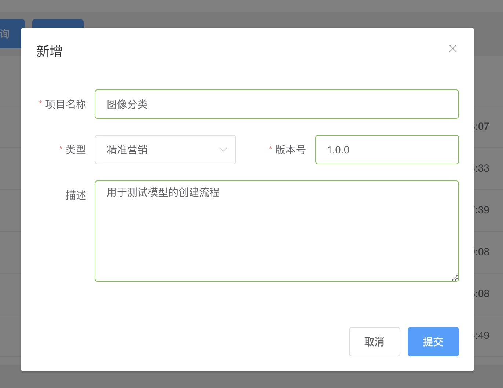
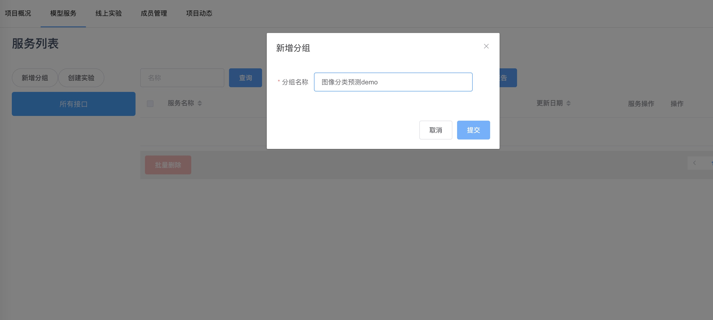
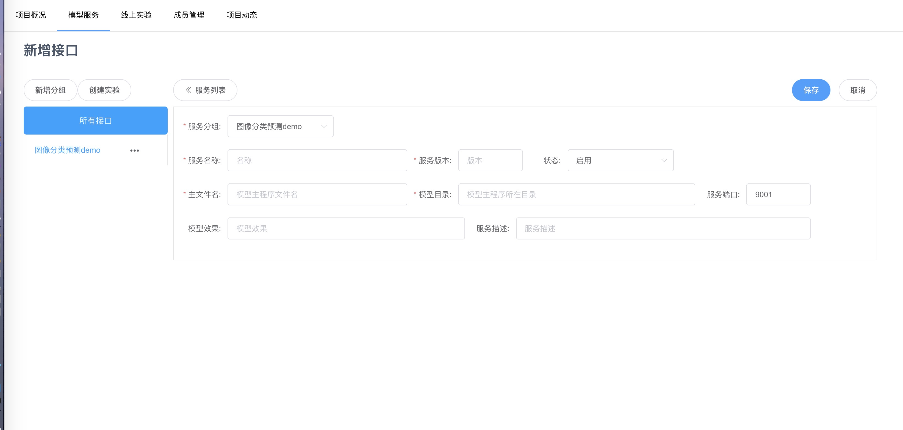
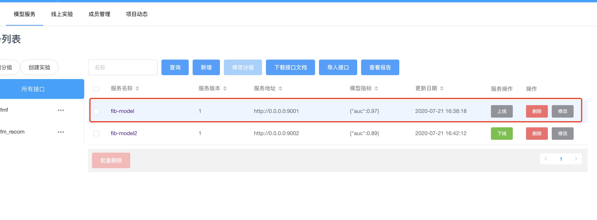
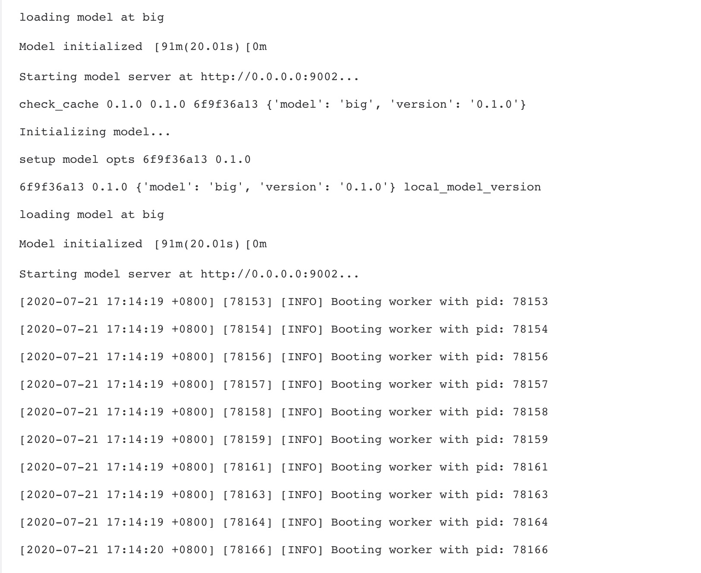
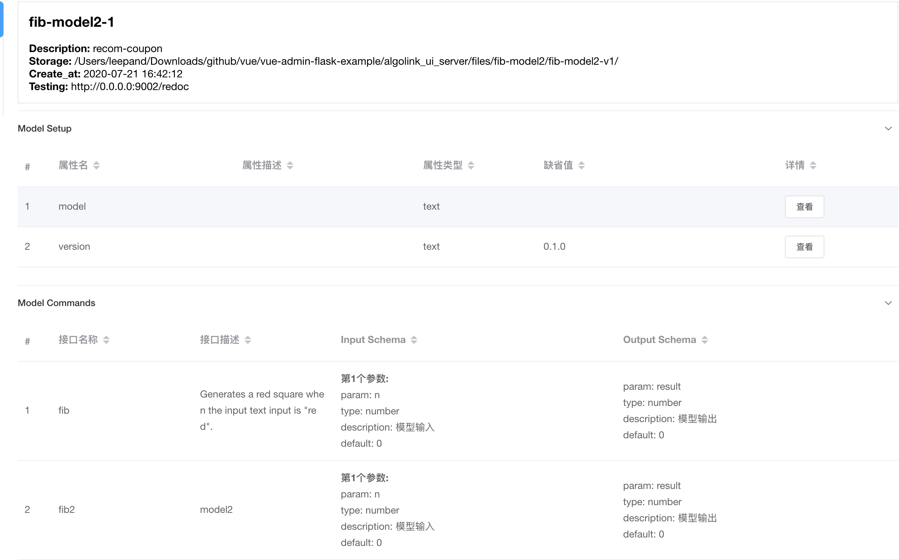

# 添加模型至AlgoLink

## 概览
以下是将Python编写的ML模型移植到AlgoLink中的步骤:

1. 创建一个 `cloud_model.py` 预测函数文件，该文件使用AlgoLink插件对用户local模型进行微调和修饰
2. (Optional) pip freeze >requirements.txt 打包预测时依赖的包
3. 创建独立文件目录，并将`cloud_model.py`及涉及的模型文件移至该目录
4. 登陆AlgoLink进行相关注册和发布操作.

当服务本身发生版本变化时可以循环上述4个步骤进行版本升级和发布，而模型版本的变化通过API进行操作（后续单独分享）。

一旦在AlgoLink上新建（注册）模型信息，就会生成最新版本的服务，操作发布后就会生成新版本的API。

## Tutorial 1: 创建模型服务文件

### Step 1. 撰写预测函数文件

```python
# cloud_model.py
import json
from PIL import Image
from torchvision import models, transforms
from torch.autograd import Variable

# Read the index -> label mapping from a file
labels = json.load(open('labels.json'))

# set up preprocessing transformations

normalize = transforms.Normalize(
   mean=[0.485, 0.456, 0.406],
   std=[0.229, 0.224, 0.225]
)

preprocess = transforms.Compose([
   transforms.Scale(256),
   transforms.CenterCrop(224),
   transforms.ToTensor(),
   normalize
])

# initialize the model and download pre-trained weights

model = models.squeezenet1_1(pretrained=True)

# open a local image
img = Image.open('still_life.jpg')

# preprocess the image and convert it into a tensor
img_tensor = preprocess(img)
img_tensor.unsqueeze_(0)
img_variable = Variable(img_tensor)

# do a forward pass and classify the image
fc_out = model(img_variable)
label = labels[str(fc_out.data.numpy().argmax())]
print(label)
# lemon
```

接下来这里是修改后的代码，同样的模型被包装在服务器中，这样AlgoLink就可以访问它。:


```diff
import json
from PIL import Image
from torchvision import models, transforms
from torch.autograd import Variable
+ import modelcloud
+ from modelcloud.data_types import image, text

labels = json.load(open('labels.json'))

normalize = transforms.Normalize(
   mean=[0.485, 0.456, 0.406],
   std=[0.229, 0.224, 0.225]
)

preprocess = transforms.Compose([
   transforms.Scale(256),
   transforms.CenterCrop(224),
   transforms.ToTensor(),
   normalize
])

+ @modelcloud.setup
+ def setup():
+     return models.squeezenet1_1(pretrained=True)

+ @modelcloud.command('classify', inputs={ 'photo': image() }, outputs={ 'label': text() })
+ def classify(model, input):
+     img = input['photo']
      img_tensor = preprocess(img)
      img_tensor.unsqueeze_(0)
      img_variable = Variable(img_tensor)
      fc_out = model(img_variable)
      label = labels[str(fc_out.data.numpy().argmax())]
+     return { 'label': label }

+ if __name__ == '__main__':
+     modelcloud.run()
```

### Step 2. 添加模型的元信息

在创建模型阶段,你也可以添加额外的元信息以帮助别人能够更了解你的模型，该信息会在模型详情页被展示出来，以下信息可以在建模阶段注册:

* **Model Name**: 模型的名称。这里允许使用字母数字值、下划线和连字符。不允许有空格
* **Tagline**: 简短的一句话描述你的模型是做什么的
* **Description**: 对你的模型做什么的长篇描述。描述可以是一个段落或更多，并被解析为Markdown
* **Images**: (Optional)展示您模型的图片集合。您在 "图库 "选项卡中添加的第一张图片将作为该图片的缩略图。
* **LICENSE**: 定义如何使用该模型的许可证
* **Performance Notes**: 用户对该模型在GPU或CPU环境下的表现有何期待？
* **Code, Paper, and More**: 与你的模型相关的资源链接列表，如源代码、arXiv论文、博客文章或更多。

### Step 3. (Optional) 添加文件到您的模型

有些模型可能需要的文件太大，例如模型检查点。AlgoLink SDK 提供了一个空间来上传大文件以包含您的模型。

要上传模型文件，您需要先在 `cloud_model.py` 的optinons定义 [`algolink.file`](https://sdk.algolink.com/en/latest/data_types.html#modelcloud.data_types.file) 数据类型。 例如, 如果您的模型支持以Python pickle格式加载检查点 (`.pkl`), 您可以通过以下方式为您的模型添加一个接受pickle文件的设置选项。:

```python
# cloud_model.py
@modelcloud.setup(options={'checkpoint': runway.file(extension='.pkl')})
def setup(opts):
   checkpoint_path = opts['checkpoint']
   model = load_model_from_checkpoint(checkpoint_path)
   # ...
```

一旦您在模型中添加了一个文件选项并成功建立了模型，AlgoLink会自动将其一同`cloud_model.py`打包上传到模型中心。

## Tutorial 2: 注册模型服务
先向cloud_model.py文件所在目录传入模型文件，使得预测函数可以load该模型，同时将预测依赖的包填入requirements.txt 文件中，发布时创建容器时需要载入，以使得模型能够正常运行。

<p class='subtitle'>cloud_model.py包含的内容</p>

后端, AlgoLink的python SDK使用 `@modelcloud.command()` 启动一个端点为 `/classify` 的服务用来处理base64-encoded图像文件.该SDK在处理`classify()` 分类前，先将图像信息转化为`PIL.Image` ，最终预测返回文本标签.

<p class="note"><b>NOTE:</b> 当然你不需要使用AlgoLink Python SDK来设置服务器。你可以使用任何服务器框架(如Flask)并手动设置分类端点。SDK只是让事情变得更简单，它负责解析/序列化输入/输出，并为你自动设置端点。</p>

#### 本地测试你的`cloud_model.py`

在您配置构建环境并将模型添加到AlgoLink之前，您应该在本地进行测试，以确保它能按预期工作。使用AlgoLink的开发模式，您可以直接连接到您的模型服务器，以便在远程构建之前测试您的模型。打开您的命令行并键入:

```bash
## Optionally create and activate a Python 3 virtual environment
# virtualenv -p python3 venv && source venv/bin/activate

pip install -r requirements.txt

# Run the entrypoint script
python cloud_model.py
```

如果输出以下类似这样的输出，表明你的模型正在运行：

```
Setting up model...
Starting model server at http://0.0.0.0:9000...
```

现在您可以打开AlgoLink，并上面的 "创建 "按钮。首先创建新项目：



为你的项目取个名字，并选择类型、键入版本信息及简单描述，然后点击提交生成一个新的项目空间。
进入项目后，进到“模型服务”tab页面，创建新的分组来区分你的应用



接下来点击“新增”服务进行模型信息的注册：



一旦你确认你的模型在本地正确工作，你可以在使用AlgoLink远程构建模型之前给该服务一个名称、port（若注册时不指定系统会自动分配闲置端口）、并告知`cloud_model.py`所在的位置，AlgoLink会自己去识别相关信息并打包需要的文件和包至模型中心。文件结构：

```file
├── code
│   ├── cloud_model.py        # (Required)预测服务的主文件
│   ├── requirements.txt      # (Optional)依赖信息
│   ├── features              # (Optional)特征信息
│   └── models                # (Optional)模型所在目录，也可以在一级目录。
python: 3.6
cuda: 9.2
entrypoint: python cloud_model.py
build_steps:
  - pip install -r requirements.txt
```

## Tutorial 3: 发布模型服务
在上一步注册完信息后会在模型分组新增一条
点击“上线”按钮稍等片刻，当按钮变绿表明上线成功，此时进到详情页可以查看模型上线日志：

<p class="note">
  <b>NOTE:</b> The <code>modelcloud-python</code>会被系统自动安装在服务的容器目录 <code>通过build_steps</code>. 另外如果在注册时指定端口的情况，需要在<code>cloud_model.py</code>的末尾<code>modelcloud.run()</code>改写为<code>modelcloud.run(port=${port})</code>，另外版本信息不允许下划线
</p>

上一步`cloud_model.py`内注册的模型元信息将自动解析展示在服务详情页



---
Related Technical Support Resource: [Add Your Own Models](https://support.algolink.com/en/articles/3037632-add-your-own-models)

