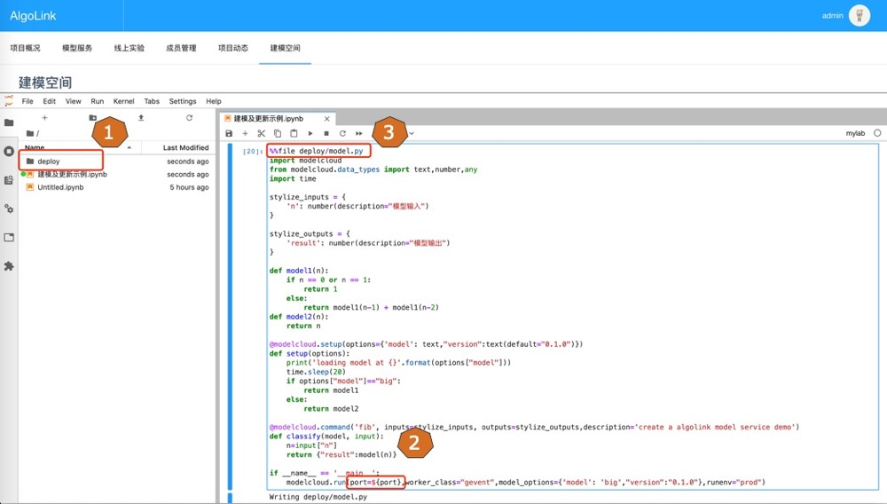

# 模型在线更新

## 概况
当部署的机器学习模型已经服务于业务时，如何在飞转的引擎下对其进行实时更新，且做到不停机？这是在机器学习应用领域绕不过去的问题，我们知道生产应用中的模型经常会更新，对于营销类的模型变化更快，更新频率经常是小时级或更频繁，那么模型的热部署和版本的自动切换会显得非常关键。

容易想到的方案：只要从POST请求中加载一个新的模型，对不？这看起来是一个简单、合适的方法，但实施关键在理解框架运作原理。

本文将介绍如何让基于AlgoLink应用程序在线更新模型到生产中的步骤。首先，我们将考虑这种方法用于一个单线程的AlgoLink应用程序。接下来，我们将在Web服务器网关接口(WSGI)后面部署它，并发现仍有不足之处。然后，我们将为模型更新添加一个进程锁，以确保在我们的应用程序更新时，其他进程继续提供响应。


当然我们需要的不仅仅是一个Flask应用：

Flask是最流行的REST API框架之一，可以用于托管机器学习（ML）模型。这一选择在很大程度上受到数据科学团队在Python方面的专业知识和用Python构建的训练模型的可重用性的影响。数据科学团队广泛使用 Flask 来服务于各种 ML 模型的预测。然而，在Flask应用为生产准备之前，需要考虑一些问题。
我们知道Flask的机制是同步的，如果Flask代码没有被修改为异步运行，那么每次每个进程只能处理一个请求。当你从应用开发扩展到每秒数百--或数千--请求的生产负载(rps)时，这可能会变成一个问题。将Flask应用产品化的第一步是将其置于WSGI后面，WSGI可以生成和管理线程/进程。当然其他框架也是可用的，如Gunicorn和Gevent。

尽管我们使用一些异步框架对Flask进行改进，并没有改变Flask的内部处理机制，假设我们已经训练了一个新的模型，并想要更新到服务中去，可行的方式是通过POST端点将新模型加载到内存中，但请记住，Flask请求是阻塞的，这意味着将新模型加载到内存的POST请求（可能需要几秒/分钟）将阻止其他GET/POST请求的执行。然而这并不是问题的全部，因为python进程之间的状态不是共享的，所以我们现在有一个进程拥有了新更新的模型，而其余的进程仍然使用的是旧模型进行的服务。新的问题是，我们如何才能有效的更新所以进程？我们能否在更新所有进程的同时，仍然保留p-1（假设该服务上线时共起了p个进程）个进程的最低吞吐量？

总结起来，在线服务的模型更新时会碰到的问题如下：
* **异步请求**: 首先需要将你的模型发布为异步服务
* **异步更新**: 需要判别当前进程是否为新模型，并在不影响其他进程的情况下依次更新各进程间的模型
* **实时检测模型状态**: 服务需要知道当前模型的版本和状态，以决定是否触发自动更新机制

我们的解决方案：

| 模块名称    | 适用阶段 | 描述  |
|------------|-----------------| ------------------|
| check_cache     | 请求后          | 每次请求后自动检查模型状态       |
| busy_signal       | 更新时            | 更新模型时对当前进程进行加锁，当有进程在进行模型更新时其他进程不进程更新                             |
| setup_model      | 更新时       | 该模块封装模型更新的实体，与模型请求模块分离                       |
| command      | 模型请求时     | 处理具体的模型请求                        |

模型实时更新原理图：


## Tutorial 1: 创建建模空间
可以在项目里的 **建模空间** 进行数据的探索、建模和模型的更新等事宜。


在该空间下可以做以下事情：
* 数据探索
* 离线模型开发与测试
* 服务封装
* 线下服务测试
* 服务更新（UI）或模型更新（API POST）


## Tutorial 2: 创建简单模型与测试

可以在建模空间进行建模和测试，效果如下（仅为示例）：


```python
def model1(n):
    if n == 0 or n == 1:
        return 1
    else:
        return model1(n-1) + model1(n-2)


def model2(n):
    return n
print("model1 result:",model1(10))
print("model2 result:",model2(10))
```


## Tutorial 3: 创建云服务及本地测试

在本地模型的基础上添加插件更新为云服务，命名为`model.py`，具体方法如下：

```diff
+ import modelcloud
+ from modelcloud.data_types import text,number,any
import time

+ stylize_inputs = {
+   'n': number(description="模型输入")
+ }

+ stylize_outputs = {
+   'result': number(description="模型输出")   
+ }

def model1(n):
    if n == 0 or n == 1:
        return 1
    else:
        return model1(n-1) + model1(n-2)

def model2(n):
    return n

+ @modelcloud.setup(options={'model': text,"version":text(default="0.1.0")})
+ def setup(options):
      time.sleep(20)
+     if options["model"]=="big":
+       return model1
+     else:
+         return model2   

+ @modelcloud.command('fib', inputs=stylize_inputs, outputs=stylize_outputs,description='create a algolink model service demo')

+ def classify(model, input):
+     n=x["n"]
+     return {"result":model(n)}

+ if __name__ == '__main__':
+     modelcloud.run(port=5001,model_options={'model': 'big',"version":"0.0.1"},runenv="prod")
```
<p class='subtitle'>Contents of model.py</p>

测试结果如下：


## Tutorial 4: 本地保存模型

上一步骤中本地测试成功后，在本地创建模型保存目录，将模型和程序均保存在该目录下，并将`port`改成`${port}`，见图中3



获取模型保存目录，后续模型注册的时候需要用到：


## Tutorial 5: 模型注册

将上一节保存后的模型注册至AlgoLink：


注册成功后会在主页显示：


## Tutorial 6: 模型上线

点击上线，模型上线成功后会呈现以下信息：


在服务详情页可以查看相关元信息：


同时在地址`http://0.0.0.0:5001/redoc`可以进行服务接口的测试：


## Tutorial 7: 模型更新

通过接口方式更新模型，将`model_options`更新为`small` 时，更新成功信息如下：


更新前模型返回结果如下：


更新后模型返回结果，可以看到有一部分的结果已经是新模型，还有一部分是旧模型：


每次请求后对剩余进程的模型进行更新，所有进程更新完毕后会返回最新模型结果：


